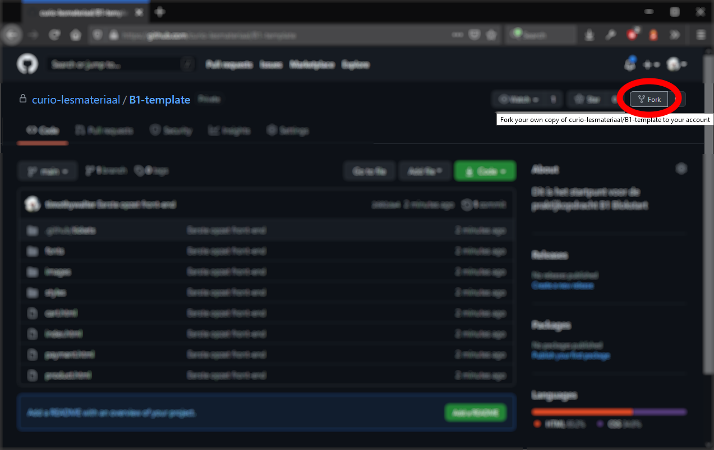
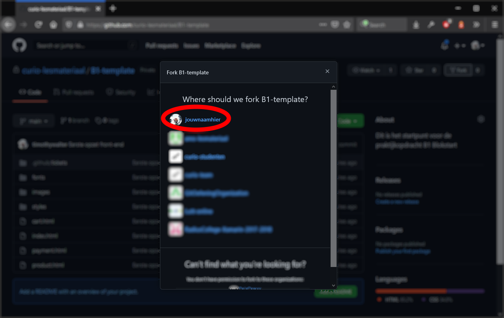
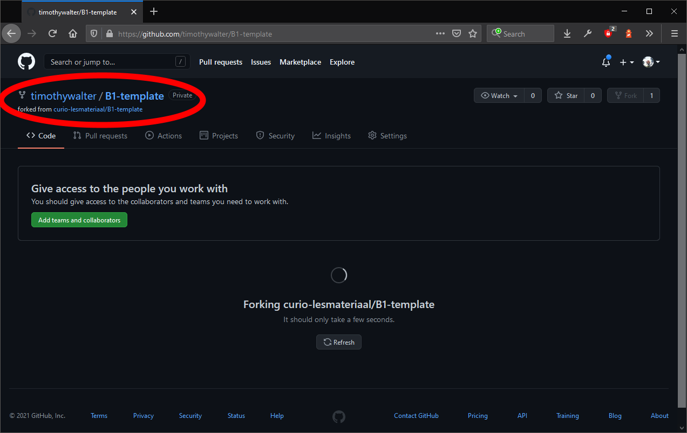
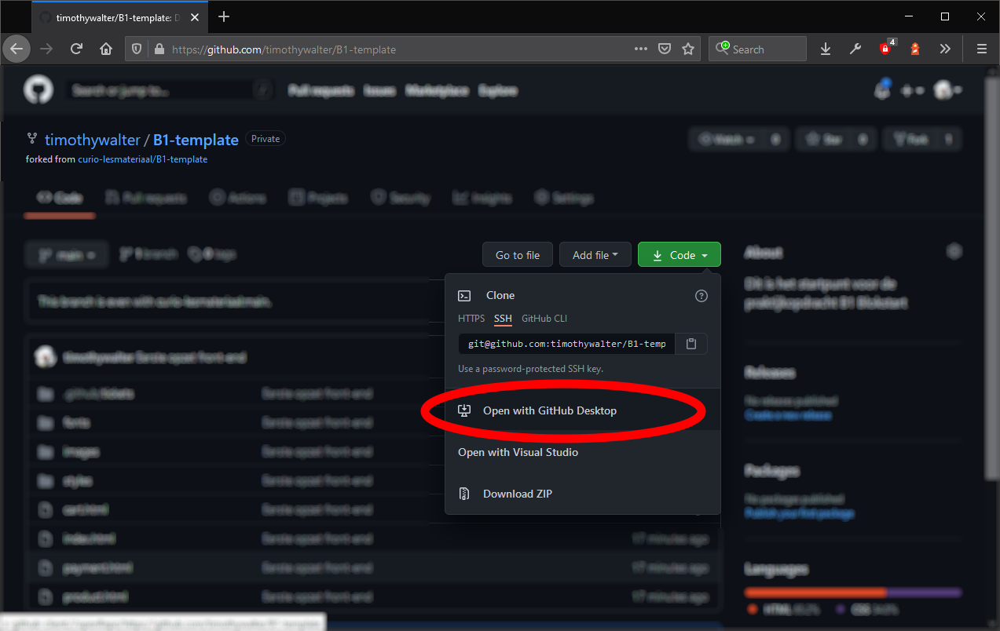
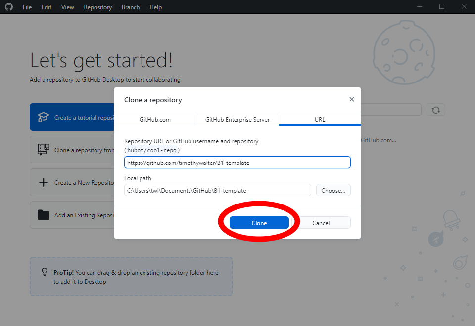
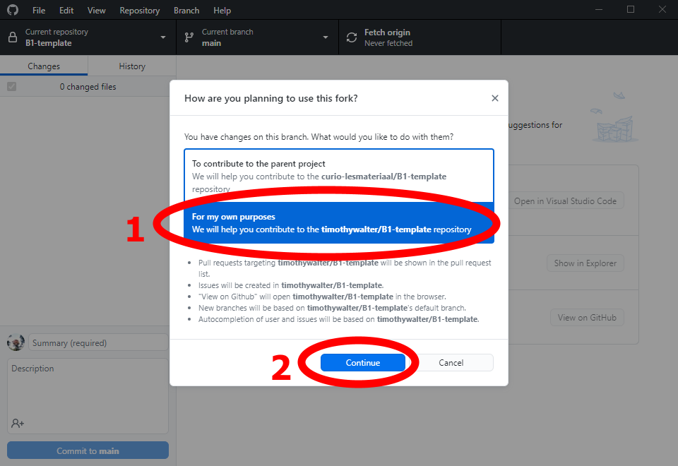

# DeveloperLand

## Aan de slag

Deze Repository (repo) bevat de front-end broncode van de DeveloperLand website. Je kunt deze vinden in de repo [curio-lesmateriaal/B1-template](https://github.com/curio-lesmateriaal/B1-template). Omdat wij geen toegang hebben om tot deze repo te schrijven en omdat het netter is eerst in onze eigen repo te werken maken wij een fork. Dat is een kopie waarin wij op onze eigen GitHub kunnen werken.

### Vereisten

* [GitHub Desktop](https://desktop.github.com/)

### Een fork maken en clonen

1. Klik rechtsboven in de 'curio-lesmateriaal/B1-template' Repository  op '**Fork**':

   

2. (Optioneel) Wanneer je lid bent van een of meerdere organisaties moet je vervolgens kiezen waar je de Fork wilt opslaan. Kies dan jouw eigen GitHub profiel:

   

3. Jouw Fork wordt nu aangemaakt. Je ziet alvast links bovenin dat jouw B1-template afgeleid is van de B1-template van curio-lesmateriaal.

   

   **De fork is nu succesvol aangemaakt en staat online bij jouw GitHub profiel.**

4. Nu willen we de fork naar onze computer brengen, zodat we de code kunnen gaan bewerken. Klik in jouw fork op **Code > Open with GitHub Desktop**

   

   *Mogelijk vraagt je browser of je GitHub desktop wilt gebruiken om deze link te openen. Sta dat toe.*

5. Nu opent GitHub Desktop en zien we dat deze onze fork probeert te clonen naar een plek op onze computer. Controleer de opslaglocatie ('Local path') en klik op **Clone**.

   

6. Tot slot vraagt GitHub Desktop hoe wij deze fork gaan gebruiken. Omdat wij bij dit project ons werk **niet** gaan toevoegen aan de originele Repository selecteren we de onderste optie **'For my own purposes'** en klikken we daarna op **Continue**.

   

7. Nu heb je jouw Fork op je computer en kan je erin gaan werken. Volg nu de rest van de instructies uit de reader van dit project.
